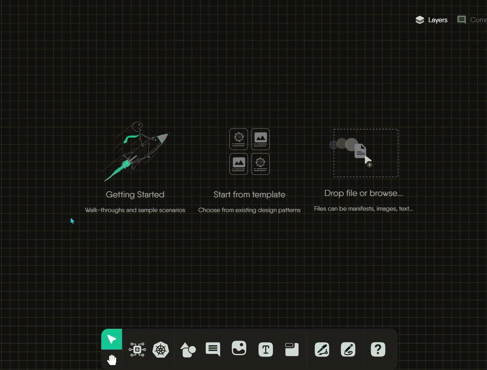
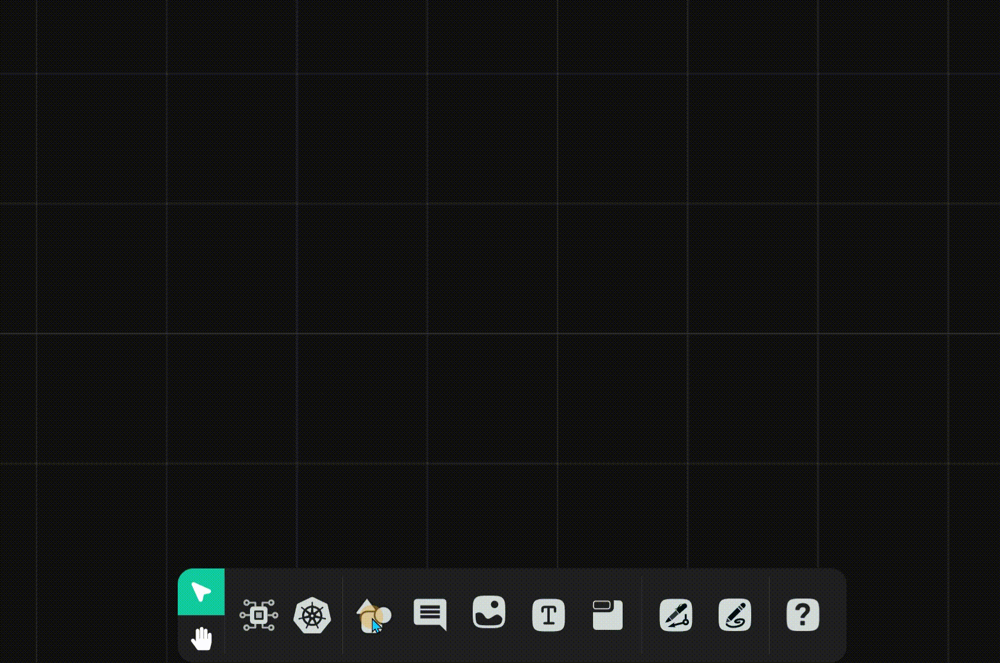
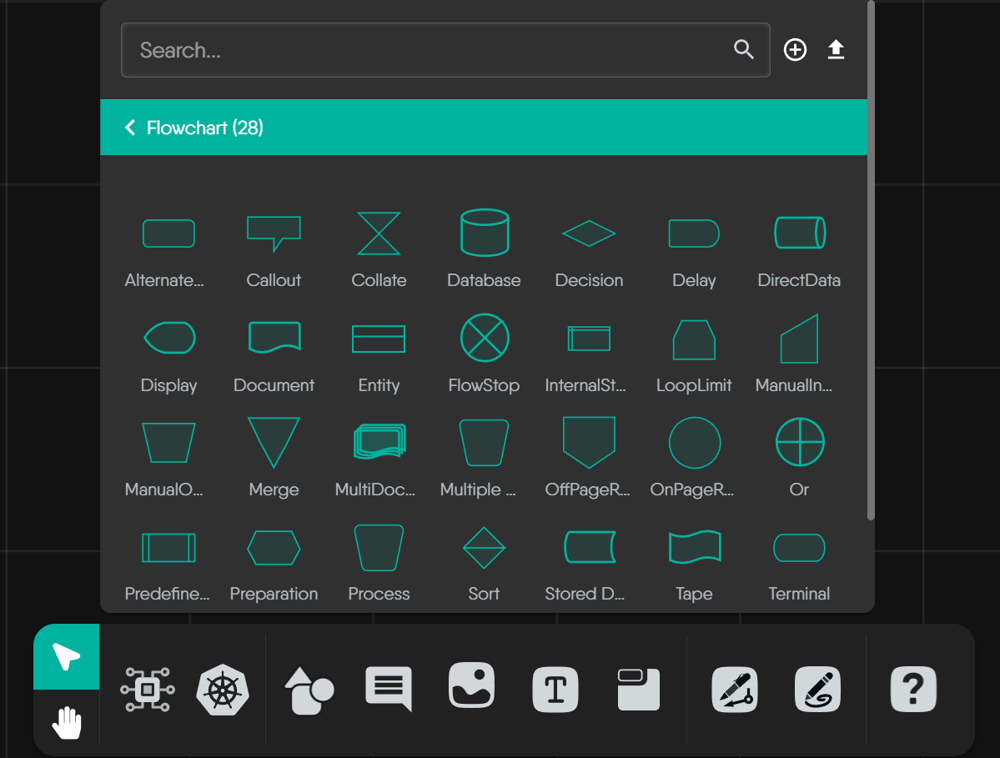

When you're designing and visualizing in [Kanvas](https://kanvas.new/), you'll encounter a rich library of components. This guide will help you understand what these components mean and how they behave in your designs.

## Core Component Categories

[Components](https://docs.meshery.io/concepts/logical/components) in Kanvas fall into two fundamental categories, distinguished by whether they can be orchestrated (managed) during deployment.

### Semantic Components (Orchestratable)
These components represent actual infrastructure resources that Kanvas can understand and manage during deployment. They are "meaningful" because they map directly to real infrastructure elements. Examples include:
- Kubernetes resources (Pods, Services, Deployments)
- Cloud provider resources (AWS S3 buckets, Azure Functions)
- Infrastructure components (Load Balancers, Databases)

These components are orchestratable because Kanvas can create, configure, and manage their lifecycle during deployment.

### Non-semantic Components (Annotation-Only)
These components are visual and organizational elements that help document and organize your designs. They are "meaningless" in terms of infrastructure because they don't represent deployable resources. Examples include:
- Text boxes and comments
- Shapes and containers for grouping
- Arrows and lines for relationships
- Labels and tags

Kanvas ignores these components during deployment as they are purely visual/organizational elements.


All components, whether semantic or non-semantic, support rich visual customization. For example, you can change a Kubernetes Pod's color from blue to green, modify its shape, or replace its background logo - it's all configurable!


## Semantic Components

These components represent real infrastructure that Kanvas can manage. They can be either built-in (like Kubernetes components) or custom components that you create.

### Kubernetes Components

While Kubernetes components are commonly used, they follow the same principles as all other semantic components. They have a distinct visual style to help you instantly recognize them:

Kanvas employs a thoughtful design system for Kubernetes resources, built on these key principles:

**Principle 1: Color and Structure**
- **Uniform Color Scheme:** Kubernetes component icons typically use a **distinctive blue background** as a standard identifier
- **Standardized Icon Structure:** The fundamental structure is consistent: an outer container shape with the blue background, encompassing a unique inner white symbol
- **Meaningful Inner Symbols:** The white symbol inside each icon is the crucial unique identifier for that specific Kubernetes Kind

**Principle 2: Shape as an Indicator**
The blue background is framed by different outer shapes that help identify the component's role:

- **Triangles:** Used for core networking resources like `Service` and `API Service`
- **Hexagons:** Used for foundational workload controllers like `StatefulSet`
- **Unique Polygons:** Used for specialized resources like `Endpoints`, `PriorityClass`, or `ValidatingWebhookConfiguration`

### Integrated Technologies

Kanvas provides a rich ecosystem of semantic components through various integrations. While Kubernetes is a commonly used example, all integration models (like KEDA, Istio, AWS, etc.) provide components with the same orchestratable capabilities.


Kanvas organizes integrated components in a clear hierarchy:
1. **Categories:** High-level groups (e.g., "Cloud Native Network", "Database")
2. **Integration Models:** Specific technologies (e.g., "AWS App Mesh", "Prometheus", "Kubernetes")
3. **Semantic Components:** Functional building blocks that can be deployed and managed



This guide covers the visual style of components. For a complete catalog of all technologies that Kanvas integrates, visit the <a href="https://docs.meshery.io/extensions/integrations">integrations directory</a>.


## Non-semantic Components

These components help you document and organize your designs without affecting the actual infrastructure. They include:

### Generic Shapes

The "Shapes" palette offers a diverse collection of annotation-only components for general-purpose diagramming. These are purely visual elements that won't be deployed.

### Arrows

Arrows are annotation-only components for showing direction or creating simple visual annotations. They are static shapes intended for illustration.


The arrows shown here are static visual aids. To represent actual, functional relationships between semantic components (like network traffic or dependencies), you should use the Edge system instead. <a href="https://docs.meshery.io/extensions/edges-shape-guide">Learn more</a>


### Flowchart Shapes

Kanvas includes a dedicated palette of standard flowchart shapes. These are annotation-only components that help document your design's logic and flow.

### Simple Line Icons

Kanvas provides a comprehensive library of **Simple Line Icons** as annotation-only components. These icons are intended for user-driven annotations and visual enhancement.

## Component Visuals in Different Contexts

A single semantic component will be visually represented differently depending on where you encounter it in Kanvas. Let's take the Deployment component as an example:

1. **Deployment component with its distinctive shape and badge:**

2. **Deployment icon as it appears in a component selection panel:**

3. **Deployment component as seen in a cluster resource overview:**

