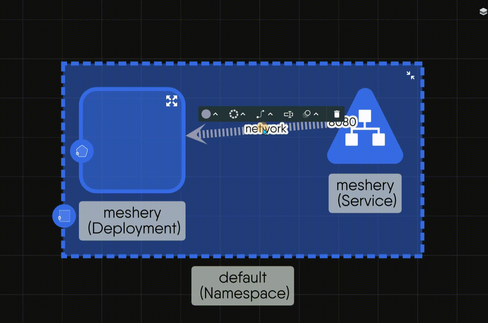

When you connect components in [Kanvas](https://kanvas.new/), the line you draw is called an edge. Each edge visually represents a [relationship](https://docs.layer5.io/kanvas/concepts/relationships/) between your components. This guide will help you understand how to use different edge styles to create clear and effective infrastructure diagrams.

## Types of Edges

In Kanvas, there are two main types of edges, each serving a different purpose:

### Semantic Edges

These edges represent real infrastructure relationships that Kanvas can understand and manage. For example:
- Network connections between services
- Volume mounts between containers
- Dependencies between components

Kanvas uses these edges during deployment to understand how your components should be connected.

> For detailed information about each relationship type, visit [Relationships Documentation](https://docs.layer5.io/kanvas/concepts/relationships/)

### Non-semantic Edges

These are visual aids that help you document and explain your design. They are useful for:
- Adding explanatory notes
- Showing conceptual relationships
- Highlighting important connections

Kanvas ignores these edges during deployment as they are purely for documentation.

## Edge Styles

### Default Edge Styles

To help you quickly understand your diagrams, Kanvas uses specific default styles for each type of edge:

**Semantic Edges**
- Style: Dotted line with an arrowhead
- Color: Grey/Blue
- Use: For all real infrastructure connections



**Non-semantic Edges**
- Style: Solid line with an arrowhead
- Color: Green
- Use: For all visual annotations and notes



### Customizing Edge Styles

While the default styles are designed to be clear and consistent, Kanvas gives you the flexibility to customize any edge to better suit your needs. Simply select an edge to reveal the styling toolbar.

#### Line Types
- Dashed Line: For proposed or optional connections
- Wave Line: For asynchronous or non-continuous connections
- Zigzag Line: For disrupted or unreliable connections
- Tree Line: For hierarchical relationships (parent-child, system-subsystem)
- Line with Circles: For weak or indirect associations
- Bezier Curve: For non-linear or indirect connections

#### Endpoint Types
- Arrow Head (Default): Shows general direction or flow
- Filled Diamond: For "whole-part" relationships (aggregation)
- Filled Square: For strong ownership relationships (composition)
- Filled Triangle: For inheritance or "is-a" relationships
- Filled Circle: For loose containment relationships

> **Note**: While Kanvas supports these UML-style relationships, the most commonly used styles are straight lines, dotted lines, and arrow heads. Use other styles when you need to express specific types of relationships in your diagrams.

#### Colors

Colors help you create a visual language in your diagrams. While Kanvas has default colors, you can use any color to convey meaning:

Default Colors
- Green: For non-semantic annotations
- Grey/Blue: For semantic relationships

Suggested Color Meanings
- Yellow: For connections that need review
- Red: For issues or breaking changes

### Labels and Annotations

You can add text directly to edges to provide more information. This is especially useful for:
- Describing traffic flow (e.g., "User Traffic → API Gateway")
- Adding process steps (e.g., "Requires Manual Review")
- Noting important details (e.g., "Backup Route (Low Priority)")
- Specifying protocols (e.g., "gRPC / 50051")

### Visual Effects

The "Marching-ants" animation effect can be added to any edge to:
- Highlight specific connections in team reviews
- Emphasize critical paths


To learn how to interpret and understand designs in practice, including how components work together in a design, visit our comprehensive guide in the [Layer5 Academy](https://cloud.layer5.io/academy/learning-paths/mastering-meshery/introduction-to-meshery?chapter=interpreting-meshery-designs).

