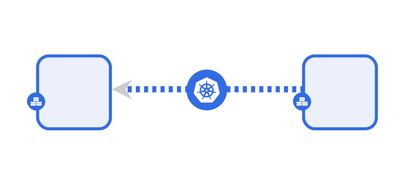

## What are Meshery Relationships?
Relationships define the nature of interaction between interconnected components in Meshery. They represent various types of connections and dependencies between components no matter the genealogy of the relationship such as parent, siblings, binding.

## Types of Relationships

Relationships are categorized into different kinds, types, and subtypes, so that can be expressive of the specific manner in which one or more components relate to one another.

Here is a list of the different types of relationships that Meshery supports:

1. Edge-Network
      The Edge-Network relationship type configures the networking between one or more components. An example is the         relationship between an Ingress and a Service.
   
      
   
1. Edge-Firewall
   An example of this relationship is that between two Pods.
   
   
   
1. Edge-Mount
   Here's an example of an Edge-Mount relationship.
   
   
   
1. Edge-Permission
   Here's an example of an Edge-Permission relationship
   
   
   
1. Hierarchical-Inventory
   Here's an example of a Hierarchical-Inventory relationship
   
   
   
1. Hierarchical-Parent
   Here's an example of a Hierarchical-Parent relationship
   
   
